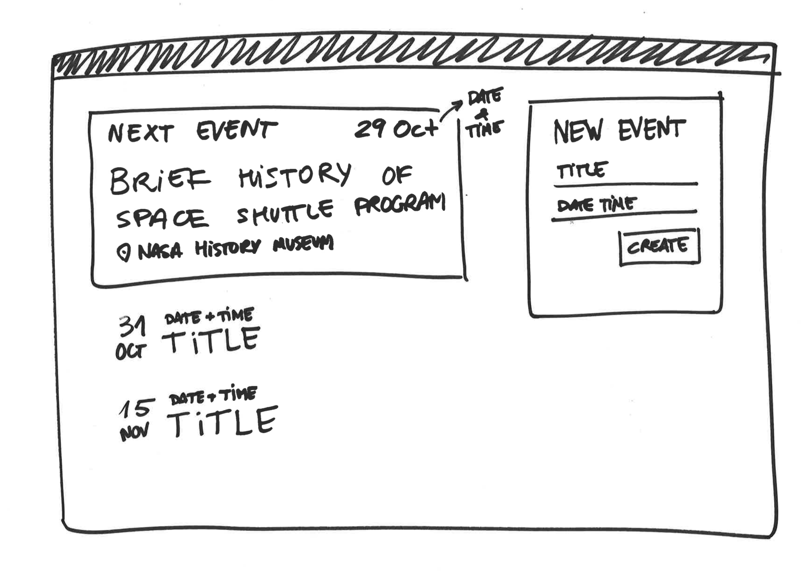

# Weekly assessment 6 (4 hours)

This is your final weekly assessment, it sums up many concepts you’ve learned in the junior part of the course, and it marks your passage to the senior part.

You have to create a full-stack app to post and find events.

Make sure to:

- Use proper indentation.
- Comment your code where needed.
- Lint your code before committing.
- Commit often and follow the [Semantic Commit Message](https://seesparkbox.com/foundry/semantic_commit_messages) convention.

## Front End

Start by creating the Front End, in the meantime you can use the Back End we provide at `https://cw-events-092017.herokuapp.com/`. You can find all its documentation in the next section here below.

The provided Back End is shared between everyone, so expect some events that you don’t create to be listed. Please, be respectful of others and polite with the events you create.

We encourage you to put all the *Presentational Components* in the `components` folder and the *Container Components* in the `containers` folder.

- Use the React CLI to set-up the client folder, running `create-react-app client`.

- To allow our linter setup work, go into the client folder (`cd client`), open the package.json file with an editor, and remove the following part of code:

```json
  "eslintConfig": {  
    "extends": "react-app"
  }
```

- Add Redux to your app.

- Your app should allow users to do the following:

  - View a list of the upcoming events.
  - Add a new event. When a new event is added, the event list should reflect the changes automatically and the form fields should be cleaned.



## Back End

Substitute the provided back-end with your own implementation.

Create a `/server` folder and implement an [Express](https://expressjs.com/) REST server connected to a MongoDB database with [Mongoose](http://mongoosejs.com/). It should offer the following API methods:

- `POST /events` - Creates a new record in the database with the following parameters:

  - `title`: *String*. A descriptive title for the event.
  - `date`: *DateTime (ISO 8601).* Date and Time of the event.
  - `venue`: *String*. Where the event is taking place.

  All these parameters are mandatory. The server should return a `200` status code for success, and a `400` HTTP status code in case any parameter is missing.

- `GET /events` - Returns a list of all events stored in the database, in JSON format. 

  ```json
  [
    {
      "id": "…",
      "title": "Brief history of Space Shuttle program",
      "date": "2016-10-29 19:00:00+01:00",
      "venue": "NASA History Museum"
    },
    {
      "id": "…",
      "title": "Why did the Challenger explode?",
      "date": "2016-11-31 18:30:00+01:00",
      "venue": "Albert II Library Building"
    }
  ]
  ```

## Extra credits

- Show a loader (e.g. spinner) when fetching the event list.
- Display an error when the POST request for a new event fails.